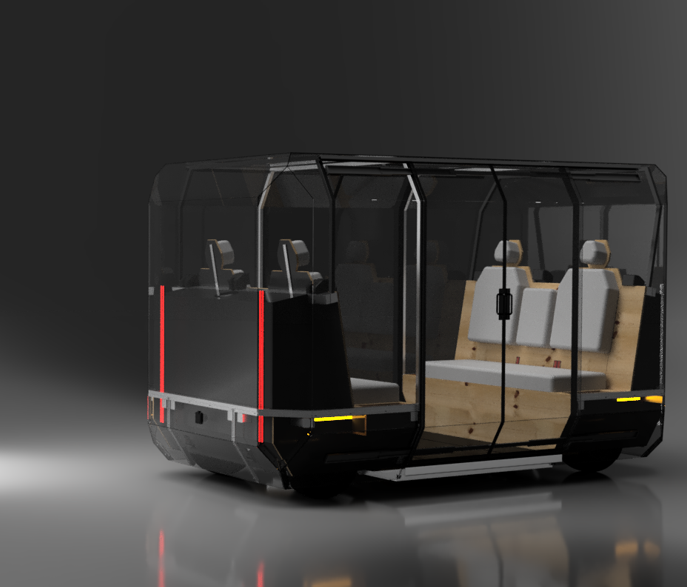
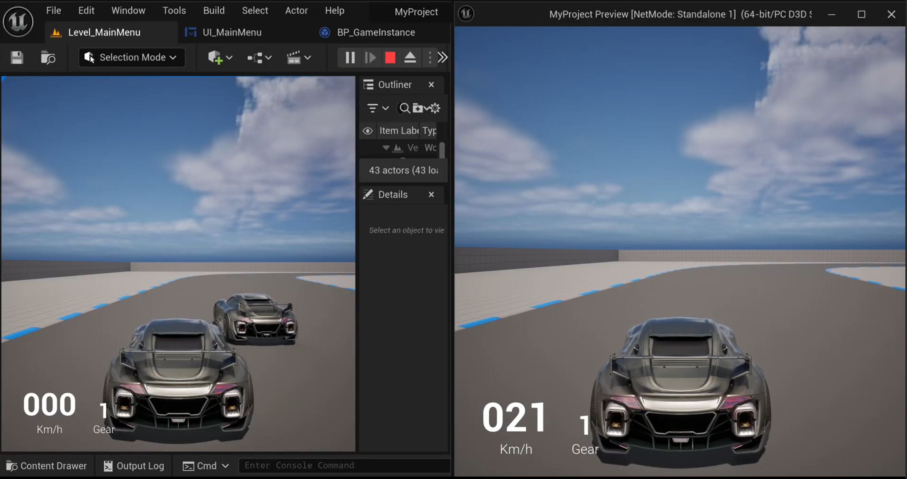

I am a **Robotics x CS student** at the **University of Michigan**, dedicated to bridging the gap between high-level code and physical motion. My work sits at the intersection of autonomous systems, deep learning, and robust software architecture. 

Beyond the code, I’m passionate about distilling complex concepts into intuition. Whether through tutoring or my work as an IA, I find as much fulfillment in debugging a peer’s logic as I do in optimizing a robot’s trajectory.

## What I’m BUILDING Right Now
* **NiFT Autonomous Shuttle (Perot Jain TechLab at Mcity):** I am delivering a proof-of-concept that transforms the NiFT Shuttle QB into an L4 autonomous vehicle, leveraging infrastructure-based sensing and routing protocols. My detailed responsibilities include vehicle assembly, sensor configuration, robust systems engineering, and an economic analysis of depot autonomy.

NiFT Shuttle QB here!

* **SIM-26 Driving Simulator (Multidisciplinary Design Program):** I am leading development on an accessible driving simulator powered by Unreal Engine 5. The engineering scope includes procedurally generating drivable worlds, configuring vehicle dynamics, simulating complex traffic flows, and implementing a low-cost steering system and motion base to enhance realism. Utilizing these high-fidelity simulations, the MDP team designs and conducts human performance experiments to research driver workload and distraction.

Building Multiplayer server in UE5 environment used for driver distraction and workload experiments.

## What I'm TEACHING Right now

  

    U-M Robotics Department | 2026 – Present
    <h3>ROB 320 Instructional Aid</h3>
    
Supporting the next generation of roboticists by helping lab sections, holding office hours, exam making and grading for ROB 320: Robot Operation System. I help students on topics like <strong>Linux IPC in C/C++</strong>, developing <strong>custom ROS-like middleware</strong>, and <strong>kinematics & transforms</strong>.

  

  

    U-M Math Learning Center | 2025 – Present
    <h3>Math 115/116/215 Tutor</h3>
    
Delivering 10 hrs/week of drop-in and group tutoring for <strong>Calculus I-III</strong>. To foster a better learning environment, I also facilitate weekly Math 215 study groups with Graduate Student Instructors, supporting 20–30 students with structured problem sets.

  

---